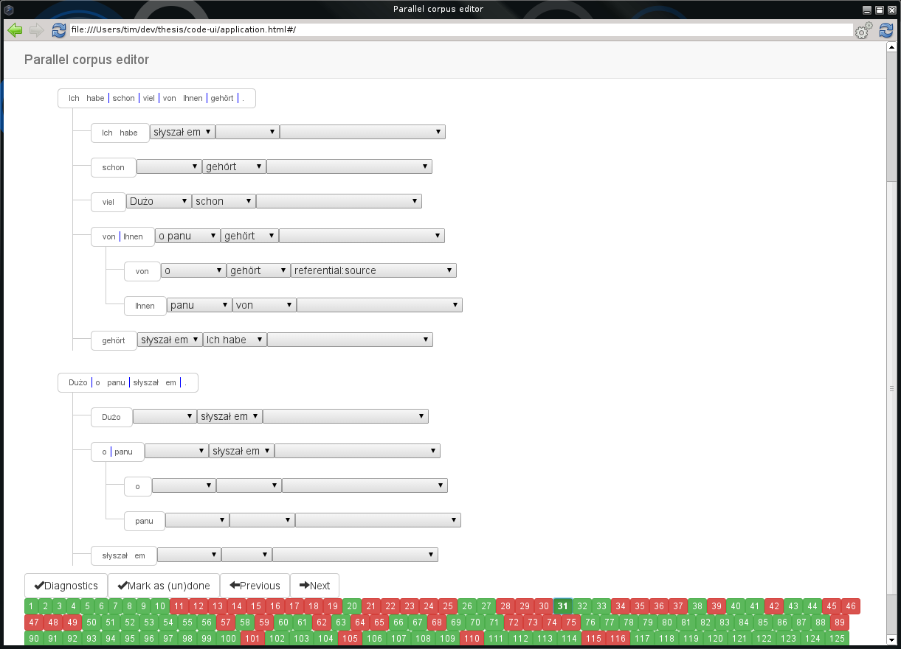

# Parallel corpus editor
poliglot-ui is an editor for structuring and annotating a parallel sentence corpus.



## Installation
**Dependencies:** node-webkit, Node.js, Scala and sbt.

```bash
$ git clone git@github.com:widok/widok.git
$ cd widok
$ sbt publish-local

$ git clone git@github.com:poliglot/poliglot-ui.git

$ npm install elementtree

$ cd poliglot-ui
$ sbt fastOptJS
```

## Usage
To use it with the annotated German-Polish corpus, run:

```
$ git clone git@github.com:poliglot/parallel-de-pl.git
$ nw . ../parallel-de-pl/alignments.xml ../parallel-de-pl/classes.txt
```

Sentences are split into tokens. Two or more adjacent tokens can form an entity. Entities may have a parent and an alignment.

## License
Poliglot is licensed under the terms of the Apache v2.0 license.

## Authors
- Tim Nieradzik
